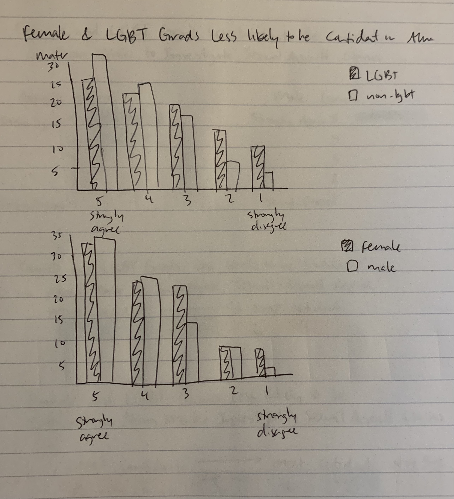
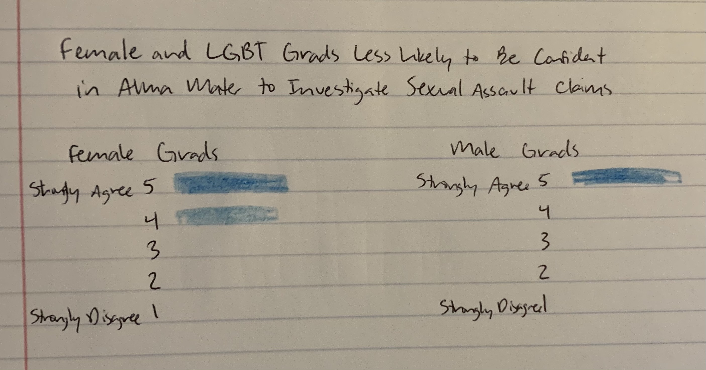
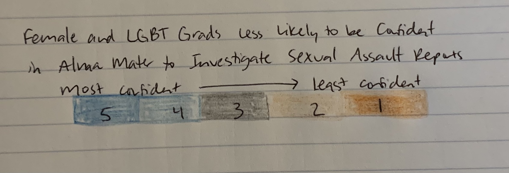
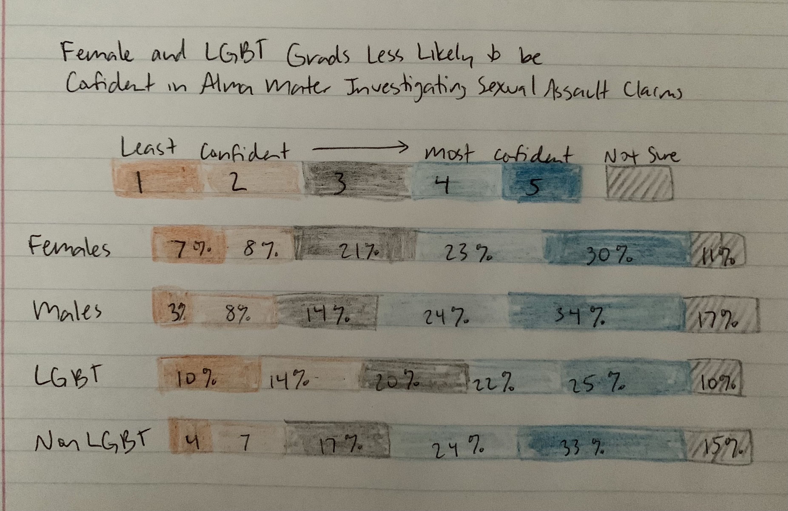

# Assignment 3 & 4: Critique by Design

## Original Visualization: Alumni Reflect on College Responsiveness to Sexual Assault

I found this visualization in a [Gallup news article](https://news.gallup.com/poll/311675/alumni-reflect-college-responsiveness-sex-assault.aspx) titled "Alumni Reflect on College Responsiveness to Sexual Assault" by Stephanie Marken. The article discusses the confidence levels of college alumni on how likely they believe their alma maters would be to fully investigate any sexual assault claims. The article uses this table to compare confidence levels between female and male alumni as well as LGBT alumni versus non-LGBT alumni; the article includes another table dividing data into public and private university alumni. I selected this table because I was really intersted in the article and the data, and was intrigued by the subtitle noting how female and LGBT alumni, groups who are more likely to report sexual assault, were less likely to be confident in their alma maters' investigating those claims. However, it was difficult for me to draw that conclusion solely from looking at the table. This table is simple, clean, and visually pleasing, yet it isn't very interesting to look at and doesn't make it easy for the reader to make comparisons between groups. I found myself trying to mentally picture the data and look for differences between groups, so I wanted to redesign the visualization so that the differences were clearer just by looking at it.

## My Process
My approach to redesigning this data visualization was very focused on making it easier for the viewer to draw comparisons between the groups in the data, so that it became more clear the differences in confidence levels between females and males as well as between LGBT alumni and non-LGBT alumni. I thought the best way to compare the four groups through their Likert scale responses would be to create some kind of bar chart, so I went through a few iterations and designs.

#### Test 1

My first idea was to make two separate bar charts, one comparing female responses to males and another comparing LGBT responses to non-LGBT. However, I quickly realized that this wasn't really making it any easier for the viewer to draw conclusions from looking at the visualization. Color and neatness of this sketch would have aided some, but I wasn't happy with how it was only really evident that females and LGBT alumni had lower confidence scores until you got to the very end of each chart when looking from left to right. 

#### Test 2

I played around with the idea of separating each group and showing their confidence levels through individual horizontal bar charts. I clearly did not even attempt to finish this sketch because I realized again that this type of visualization would not aid the viewer in comparing confidence levels between groups. One thing I did take away from this iteration though was that I wanted to use color to differentiate the scored responses, 1-5, rather than use color to differentiate the key groups.

#### Test 3

This was the third design I came up with and the one I was most satisfied with. I wanted to make the 1-5 scores for each category of alumni to be close together so that it would be easier to look through the proportions and see where they were different across the groups. I also chose to present the scale from  lowest to highest confidence (1 being the lowest and 5 being the highest) from left to right so that when the viewer reads from left to right, their attention is initially drawn to the low confidence scores that the article focuses on. Because the original table didn't use color in a meaningful way, I went back to the first chapter in the Good Charts Workbook to revisit how color can be used for Likert scale data. To distinguish levels of confidence, both negative and positive, I chose to use light and dark shades of the opposing colors blue and orange. I then chose to make the score of 3 in the middle as well as the "not sure" responses gray because they were neutral responses, distinguishing them with color fill and then diagonal stripes.

## My Final Visualization
.png)

### Back to [home page](/README.md)
