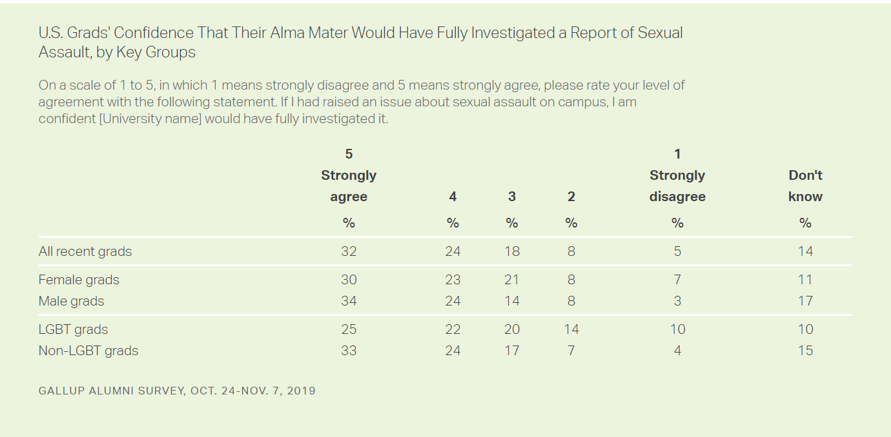

# Assignment 3 & 4: Critique by Design

## Alumni Reflect on College Responsiveness to Sexual Assault

### Original Visualization

I found this visualization in a [Gallup news article](https://news.gallup.com/poll/311675/alumni-reflect-college-responsiveness-sex-assault.aspx) titled "Alumni Reflect on College Responsiveness to Sexual Assault" by Stephanie Marken. The article discusses the confidence levels of college alumni on how likely they believe their alma maters would be to fully investigate any sexual assault claims. The article uses this table to compare confidence levels between female and male alumni as well as LGBT alumni versus non-LGBT alumni; the article includes another table dividing data into public and private university alumni. I selected this table because I was really intersted in the article and the data, and was intrigued by the subtitle noting how female and LGBT alumni, groups who are more likely to report sexual assault, were less likely to be confident in their alma maters' investigating those claims. However, it was difficult for me to draw that conclusion solely from looking at the table. This table is simple, clean, and visually pleasing, yet it isn't very interesting to look at and doesn't make it easy for the reader to make comparisons between groups. I found myself trying to mentally picture the data and look for differences between groups, so I wanted to redesign the visualization so that the differences were clearer just by looking at it.

### My Process

### My Final Visualization

### Back to [home page](/README.md)
